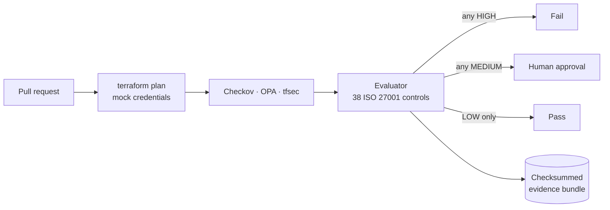

# Ayush Kumar Yadav

**Cloud Security & GRC Engineer** 
AWS · Terraform · Policy-as-Code · ISO/IEC 27001

Asansol, India · Open to remote 
[official.ayush.066@gmail.com](mailto:official.ayush.066@gmail.com) · [ayushcloud.dev](https://www.ayushcloud.dev/) · [github.com/Ayush-cloud06](https://github.com/Ayush-cloud06) · [LinkedIn](https://www.linkedin.com/in/ayush-yadav-5b8578364/)

---

I turn compliance requirements into Terraform, OPA/Rego policies and CI gates that leave audit evidence behind. I'm an ISO/IEC 27001:2022 Lead Implementer (TÜV SÜD) and an AWS Solutions Architect – Associate, currently preparing for AWS Security – Specialty.

## Featured project

### [Ayka Secure Technologies GmbH](https://github.com/Ayush-cloud06/Ayka-Secure-Technologies-GmbH): compliance-as-code for a simulated EU SaaS company

> [!NOTE]
> Ayka is a fictional 24-person SaaS company in Stuttgart, used as a case study. Each part below is labelled with its real status: **runs in CI**, **designed** (Terraform written and validated, never deployed), or **documented** (draft GRC records).

#### DevSecOps pipeline · `runs in CI`

- **Policy gate on every pull request.** Checkov and OPA/conftest read the Terraform plan JSON, tfsec reads the source, and a Python evaluator maps every finding to one of **38 controls** referenced to ISO/IEC 27001:2022 Annex A.
- **Three-way, fail-closed decision.** HIGH fails the build; MEDIUM pauses at a GitHub environment until a human approves; LOW passes. Missing, malformed or empty scanner output counts as a failure, and an unmapped finding defaults to MEDIUM so a person always reviews it.
- **Proof that the gate catches problems.** A deliberately insecure workload (public S3, open SSH, IMDSv1, no encryption, open NACL) has to fail with specific controls reported by specific tools, otherwise CI goes red.
- **Audit evidence from every run.** Each run produces a bundle: the plan, raw scanner JSON, a Markdown report, and a manifest that records the commit, tool versions and SHA-256 hashes of the mapping, the evaluator and every Rego file. The apply step re-checks those hashes before it runs.
- **Exceptions with accountability.** Every waived finding needs a reason, an owner and an expiry date, and it still shows up in the report.
- **A hardened pipeline.** Tools are pinned by checksum and actions by commit SHA. The token is read-only, CI holds no cloud credentials, gate logic is covered by CODEOWNERS, and `main` requires 5 passing checks.
- **Tested end to end.** CI runs 48 Python tests and 37 Rego tests. I found and fixed a wrapper bug that silently dropped every tfsec finding, then added a test so it can't come back.

#### Identity & access · `designed`

- **Joiner-to-access chain in Terraform.** An HR dataset feeds Microsoft Entra ID users and department/tier groups. SCIM provisions them into AWS IAM Identity Center, and tiered permission sets lead into cross-account IAM roles.
- **Tiered privilege.** Three permission sets (Platform-Admin, Tier1-Ops, Tier2-Workload) with 8-hour sessions and a 1-hour session for high-privilege work. Entra Conditional Access policies require MFA for Tier 0 and block legacy authentication.
- **ABAC and escalation control.** Department isolation compares `aws:PrincipalTag/Department` with `aws:ResourceTag/Department`, with mandatory tagging and permission boundaries to block privilege escalation.
- **AWS Organizations guardrails.** Security, Infrastructure and Workloads OUs, with SCPs that stop CloudTrail from being disabled, deny root-user activity and restrict Regions. Break-glass roles come with a written procedure.

#### GRC · `documented`

- **ISO/IEC 27001:2022 ISMS.** Scope, information security policy, risk methodology and criteria, a register of **13 risks** scored 5×5 (inherent, current and target), plus a treatment plan and an acceptance log. One control (A.8.24, S3 encryption) is traced end to end: risk → requirement → Terraform → test → CI evidence.
- **SOC 2.** System description, Trust Services Criteria scoping (Security, Availability and Confidentiality in scope; Processing Integrity and Privacy out, with reasons), control matrix and 7 policies. The readiness assessment concludes the company is **not ready for a Type I** and explains why.
- **NIS2.** Applicability assessment under Germany's NIS2UmsuCG/BSIG: with 24 staff, Ayka is below the threshold but still inherits NIS2 duties through customers' supply-chain requirements. Includes an Art. 21 gap assessment and an Art. 23 incident-reporting procedure.
- **GDPR.** Art. 30 record of processing, Art. 28 processor register, and Art. 32 measures for identity and segregation of duties. I found that the region SCP (`ap-south-1`) contradicts the EU data-residency target and logged it as a risk.

## Other projects

### [Cloud Platform Control Plane](https://github.com/Ayush-cloud06/cloud-platform-control-plane) · Terraform module

- Hardens a bare AWS account in one `apply`:
  - MFA-gated, role-only IAM.
  - A permission boundary that denies all IAM actions and denies disabling CloudTrail, GuardDuty or Config.
  - Multi-region CloudTrail with KMS, log validation and optional S3 Object Lock.
  - 15 alarms for CIS AWS Foundations v3.0.0 controls 4.1–4.15.
- Every control maps to CIS, ISO 27001 and NIST CSF with an evidence command an auditor can run. CI runs 27 `terraform test` cases against a mocked provider, plus Checkov → SARIF, TFLint and gitleaks.

<b>Earlier projects</b>

 

| Project | What it does | Stack |
| :-- | :-- | :-- |
| [Compliance-Gated Deployment Pipeline](https://github.com/Ayush-cloud06/Compliance-Gated-Deployment-Pipeline) | Checkov before apply, human-approved apply over OIDC, Prowler + OPA after, evidence in versioned S3 | GitHub Actions · OIDC · Prowler · OPA |
| [AWS Automated Remediation Guardrails](https://github.com/Ayush-cloud06/aws-automated-remediation-guardrails) | Config and GuardDuty findings trigger Lambda fixes: block public S3, revoke open SSH, delete root keys | EventBridge · Lambda · SNS |
| [Cloud Policy Engine](https://github.com/Ayush-cloud06/Cloud-Policy-Engine) | Rego rules for Terraform plans and live AWS state | OPA · Rego |
| [Cloud Security Compliance Automation](https://github.com/Ayush-cloud06/cloud-security-compliance-automation) | IAM access-key and S3 ACL audits with CSV/JSON evidence | Python · boto3 |

## Technical skills

| | |
| :-- | :-- |
| **AWS** | IAM, Identity Center, Organizations & SCPs, CloudTrail, CloudWatch, Config, GuardDuty, Security Hub, KMS, S3, EventBridge, Lambda, SNS, Firehose |
| **Identity** | Microsoft Entra ID, SCIM, Conditional Access, RBAC & ABAC, permission boundaries, break-glass access |
| **IaC & CI/CD** | Terraform (modules, feature flags, `terraform test`, TFLint), GitHub Actions, OIDC federation, environments & rulesets |
| **Policy & scanning** | OPA/Rego (conftest), Checkov, tfsec, Prowler, gitleaks |
| **GRC** | ISO/IEC 27001:2022, SOC 2 (TSC), NIS2 / BSIG, GDPR, CIS AWS Foundations, NIST CSF 2.0 |
| **Languages** | Python (boto3, pytest), Bash, HCL, Rego · Docker (basic) |

## Certifications

| Certification | Issuer | Date |
| :-- | :-- | :-- |
| ISO/IEC 27001:2022 Lead Implementer | TÜV SÜD · Cert. No. IN/62172/645925 | Sep 2026 |
| AWS Certified Solutions Architect – Associate | Amazon Web Services | Jul 2026 · valid to Jul 2029 |
| AWS Certified Security – Specialty | Amazon Web Services | In preparation |

## Education

**B.A. English (Honours)**, Bidhan Chandra College, Asansol · *expected 2027*
